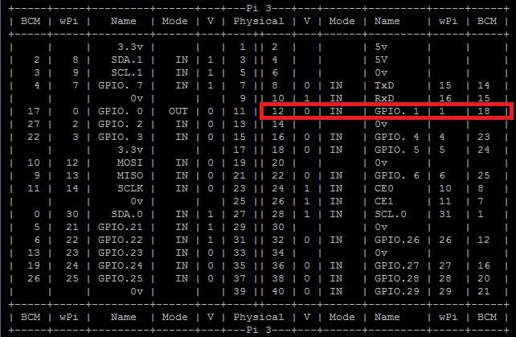

# PIFanTuner
RaspberryPI CPU fan tuner with a s8050 triode.

This project enables a daemon which manage a CPU fan for you, it will start
after system bootstrapping automatically.It enables CPU fan while its temperature
is more than 45°(or defined by you), else the fan will be turned off. 

You can also view your cpu temperature within this project or turn on/off
a given GPIO port by simple commandline tool.

# How to

## Requires
Hardware

+ A Fan that works under 5v Voltage
+ A NPN triode(such as s8050) 

Software

+ Python 2.6+
+ Raspbian(optional)

## Hardware Setup
At first , follow the diagram below and connect your triode and fan together.

Your triode may be like this one:


The circuit diagram is like this one:


About Raspberry Pi PIN number

Use `gpio readall` to get map like following image.




## Software Setup


### General
Enter console of your Raspberry Pi then start with

```
git clone https://github.com/winkidney/PIFanTuner.git
```

Or just download the zip file zipped by Github.

Then enter the project directory:

```
sudo python setup.py install
```

Now use following command to run fan-control daemon:

```
➜  ~ pi-fan-tuner fan simple --debug
DEBUG:root:Temperature 45.084 CPU fan on.
```

### Raspbian

With raspbian or any system works well with systemd, you can use systemd
service script to make `pi-fan-tuner` a daemon which automatically manage
your fan.

After installation of the python package, you could run
```
./install-systemd-file.sh
```

to setup the systemd script for `pi-fan-tuner`.


## Advanced

Monitoring CPU temperature
```
pi-fan-tuner cpu-show --loop
```

For other usage, please run:

```
pi-fan-tuner --help
```